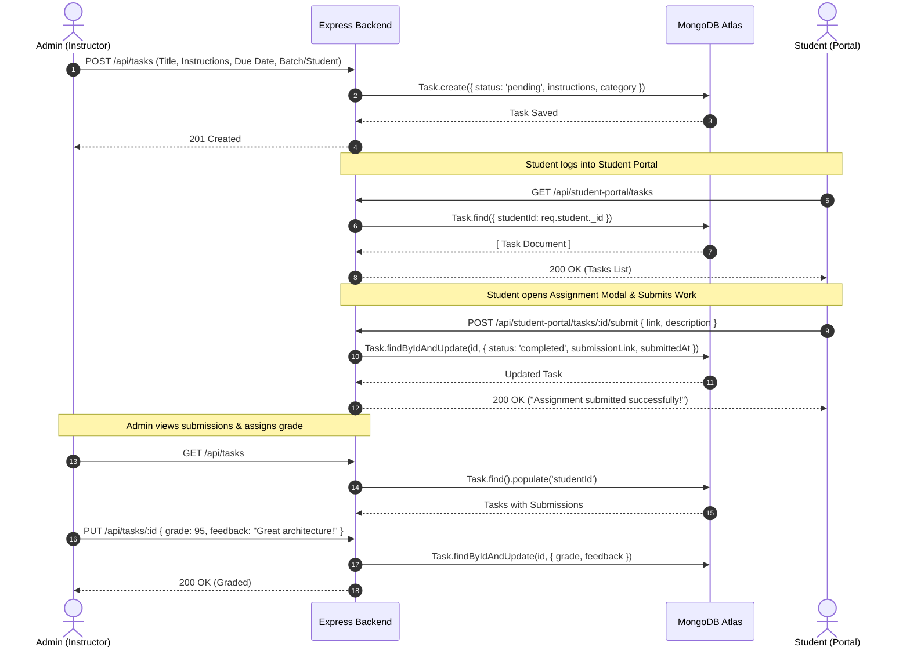
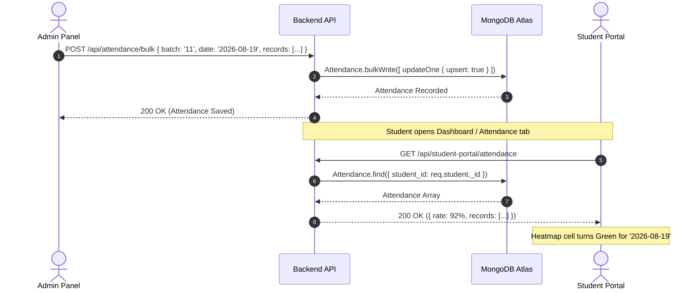

# Saylani Bootcamp LMS — Full Backend Integration & Architecture Guide

> **Document Version:** 2.0.0  
> **Target Scope:** Express.js + MongoDB backend synchronization with `student-side` and `Client` (Admin Panel)  
> **Status:** Production Blueprint & Implementation Specification

---

## 1. Executive Summary & Architectural Gap Analysis

### 1.1 Current State of Backend
Currently, the `Server` codebase operates primarily as an **Admin-Only REST API**:
1. **Global Admin Protection:** In `app.js`, `protectAdmin` is applied directly at root route mounting (e.g., `app.use("/api/tasks", protectAdmin, taskRoutes)`). This completely blocks any non-admin request.
2. **Missing Student Authentication:** The `Student` model has no `password`, `tokenVersion`, or credential verification methods. Students have no login endpoints, JWT issuance, or session state.
3. **Incomplete Task Workflow:** The `Task` schema lacks assignment instructions, categories/subjects, student submission links (`submissionLink`), submission notes, submission timestamps, grading, and feedback.
4. **No Student Portal Endpoints:** There are no dedicated student routes (`/api/student-portal/*` and `/api/student-auth/*`) for self-service dashboard aggregation, assignment submission, project milestone tracking, or attendance summaries.

### 1.2 Target Production Architecture
The updated backend implements a **Dual-Role Unified LMS Engine** where Admins and Students share database entities with strict role-based access control (RBAC):

```
┌─────────────────────────┐                     ┌─────────────────────────┐
│   Admin Panel (Client)  │                     │   Student Side (React)  │
│  Role: 'admin'          │                     │  Role: 'student'        │
└────────────┬────────────┘                     └────────────┬────────────┘
             │ Bearer JWT (Admin)                            │ Bearer JWT (Student)
             ▼                                               ▼
┌─────────────────────────────────────────────────────────────────────────┐
│                           Express.js Application                        │
│                                                                         │
│  ┌───────────────────────┐                    ┌──────────────────────┐  │
│  │   /api/admin/*        │                    │  /api/student-auth/* │  │
│  │   /api/tasks (Admin)  │                    │  /api/student-portal │  │
│  │   /api/attendance     │                    │    ├── /dashboard    │  │
│  │   /api/teams          │                    │    ├── /tasks        │  │
│  │   /api/projects       │                    │    ├── /attendance   │  │
│  └───────────┬───────────┘                    │    ├── /project      │  │
│              │                                │    └── /profile      │  │
│              │                                └──────────┬───────────┘  │
│              ▼                                           ▼              │
│       [ protectAdmin ]                            [ protectStudent ]    │
│              │                                           │              │
│              └───────────────────┬───────────────────────┘              │
│                                  ▼                                      │
│                      [ Business Service Layer ]                         │
│                                  ▼                                      │
│                  [ Mongoose Models / MongoDB Atlas ]                    │
│    (Student, Task, Project, Team, Attendance, Notification, Admin)      │
└─────────────────────────────────────────────────────────────────────────┘
```

---

## 2. Database Models & Schema Upgrades

### 2.1 `Student` Model (`Server/models/student.Model.js`)

#### Required New Fields:
| Field | Type | Default / Constraints | Purpose |
| :--- | :--- | :--- | :--- |
| `password` | `String` | Required (`minlength: 6`, `select: false`) | Hashed bcrypt password for student login |
| `avatar` | `String` | `""` | Student profile photo URL or initials avatar |
| `bio` | `String` | `""` (max 500 chars) | Profile bio section |
| `skills` | `[String]` | `[]` (e.g. `["React", "Node.js"]`) | Technical skills shown in student profile |
| `githubUsername` | `String` | `""` | GitHub handle (e.g., `DoctorJunaid`) |
| `tokenVersion` | `Number` | `0` | For single-click invalidation / logout of all sessions |
| `status` | `String` | Enum: `["active", "suspended", "graduated"]`, default: `"active"` | Student status flag |
| `settings` | `Object` | Email alerts, attendance thresholds | Student preference storage |

#### Complete Upgraded Code:
```javascript
import mongoose from "mongoose";
import bcrypt from "bcryptjs";

const studentSchema = new mongoose.Schema(
  {
    rollNumber: {
      type: String,
      required: [true, "Roll number is required"],
      unique: true,
      trim: true,
      index: true,
    },
    name: {
      type: String,
      required: [true, "Name is required"],
      trim: true,
    },
    email: {
      type: String,
      required: [true, "Email is required"],
      unique: true,
      trim: true,
      lowercase: true,
      match: [/^\S+@\S+\.\S+$/, "Please provide a valid email address"],
    },
    password: {
      type: String,
      required: [true, "Password is required"],
      minlength: [6, "Password must be at least 6 characters"],
      select: false, // Never return password hash in queries by default
    },
    phone: {
      type: String,
      default: "",
      trim: true,
    },
    course: {
      type: String,
      required: [true, "Course is required"],
      trim: true,
    },
    batch: {
      type: String,
      required: [true, "Batch is required"],
      trim: true,
    },
    team_id: {
      type: mongoose.Schema.Types.ObjectId,
      ref: "Team",
      default: null,
    },
    avatar: {
      type: String,
      default: "",
    },
    bio: {
      type: String,
      default: "Full stack developer passionate about building clean, scalable web applications.",
      maxlength: 500,
    },
    skills: {
      type: [String],
      default: ["JavaScript", "React", "Node.js", "MongoDB", "Express", "REST APIs"],
    },
    githubUsername: {
      type: String,
      default: "",
      trim: true,
    },
    status: {
      type: String,
      enum: ["active", "suspended", "graduated"],
      default: "active",
    },
    tokenVersion: {
      type: Number,
      default: 0,
    },
    settings: {
      emailNotifications: { type: Boolean, default: true },
      attendanceAlerts: { type: Boolean, default: true },
      teamActivityFeed: { type: Boolean, default: true },
    },
  },
  {
    timestamps: true,
  }
);

// Hash password before saving
studentSchema.pre("save", async function (next) {
  if (!this.isModified("password")) return next();
  const salt = await bcrypt.genSalt(10);
  this.password = await bcrypt.hash(this.password, salt);
  next();
});

// Instance method to compare password
studentSchema.methods.comparePassword = async function (candidatePassword) {
  return await bcrypt.compare(candidatePassword, this.password);
};

const Student = mongoose.model("Student", studentSchema);
export default Student;
```

---

### 2.2 `Task` Model (`Server/models/taskModel.js`)

#### Required New Fields:
| Field | Type | Default / Constraints | Purpose |
| :--- | :--- | :--- | :--- |
| `category` | `String` | Enum: `["Backend", "Frontend", "Design", "Database", "Testing", "DevOps"]` | Subject / Category badge |
| `priority` | `String` | Enum: `["low", "med", "high"]`, default: `"med"` | Priority indicator |
| `instructions` | `String` | Rich text instructions for student | Detailed assignment requirement |
| `submissionLink` | `String` | `""` | GitHub PR / Repo / Vercel link submitted by student |
| `submissionDescription` | `String` | `""` | Student commentary / remarks on their work |
| `submittedAt` | `Date` | `null` | Exact submission timestamp |
| `grade` | `Number` | `null` (min: 0, max: 100) | Admin grade score |
| `feedback` | `String` | `""` | Instructor review comments |
| `assignedBy` | `ObjectId` | ref: `"Admin"` | Audit tracking for who issued task |
| `batch` | `String` | Filter index | Bulk batch assignments |

#### Complete Upgraded Code:
```javascript
import mongoose from "mongoose";

const taskSchema = new mongoose.Schema(
  {
    studentId: {
      type: mongoose.Schema.Types.ObjectId,
      ref: "Student",
      required: [true, "Student ID is required"],
      index: true,
    },
    assignedBy: {
      type: mongoose.Schema.Types.ObjectId,
      ref: "Admin",
      default: null,
    },
    title: {
      type: String,
      required: [true, "Task title is required"],
      trim: true,
    },
    description: {
      type: String,
      default: "",
    },
    instructions: {
      type: String,
      default: "",
    },
    category: {
      type: String,
      enum: ["Backend", "Frontend", "Design", "Database", "Testing", "DevOps", "General"],
      default: "General",
    },
    priority: {
      type: String,
      enum: ["low", "med", "high"],
      default: "med",
    },
    dueDate: {
      type: Date,
      required: [true, "Due date is required"],
    },
    status: {
      type: String,
      enum: ["pending", "in_progress", "submitted", "completed", "resubmission_required"],
      default: "pending",
      index: true,
    },
    submissionLink: {
      type: String,
      default: "",
      trim: true,
    },
    submissionDescription: {
      type: String,
      default: "",
    },
    submittedAt: {
      type: Date,
      default: null,
    },
    grade: {
      type: Number,
      min: 0,
      max: 100,
      default: null,
    },
    feedback: {
      type: String,
      default: "",
    },
    batch: {
      type: String,
      index: true,
    },
  },
  { timestamps: true }
);

export const Task = mongoose.model("Task", taskSchema);
```

---

### 2.3 `Project` Model (`Server/models/project.Model.js`)

#### Upgraded Code with Milestones and Resource Links:
```javascript
import mongoose from "mongoose";

const milestoneSchema = new mongoose.Schema({
  name: { type: String, required: true },
  isDone: { type: Boolean, default: false },
  isActive: { type: Boolean, default: false },
  dueDate: { type: Date },
});

const projectSchema = new mongoose.Schema(
  {
    title: {
      type: String,
      required: [true, "Project name is required"],
      trim: true,
    },
    teamId: {
      type: mongoose.Schema.Types.ObjectId,
      ref: "Team",
      default: null,
    },
    description: {
      type: String,
      default: "",
    },
    longDescription: {
      type: String,
      default: "",
    },
    category: {
      type: String,
      default: "MERN Stack",
    },
    startDate: {
      type: Date,
      default: Date.now,
    },
    dueDate: {
      type: Date,
      required: true,
    },
    status: {
      type: String,
      enum: ["Not Started", "In Progress", "Under Review", "Completed"],
      default: "In Progress",
    },
    progress: {
      type: Number,
      default: 0,
      min: 0,
      max: 100,
    },
    repoLink: {
      type: String,
      default: "",
    },
    liveLink: {
      type: String,
      default: "",
    },
    thumbGradient: {
      type: String,
      default: "linear-gradient(135deg,#d8ead2,#a8c8a0)",
    },
    milestones: [milestoneSchema],
  },
  { timestamps: true }
);

export default mongoose.model("Project", projectSchema);
```

---

### 2.4 `Team` Model (`Server/models/team.Model.js`)

#### Upgraded Code with Activity Feed Tracking:
```javascript
import mongoose from "mongoose";

const activitySchema = new mongoose.Schema({
  studentId: {
    type: mongoose.Schema.Types.ObjectId,
    ref: "Student",
  },
  studentName: { type: String },
  initials: { type: String },
  action: { type: String, required: true }, // e.g. "pushed 3 commits to origin/main"
  timestamp: { type: Date, default: Date.now },
});

const teamSchema = new mongoose.Schema(
  {
    name: {
      type: String,
      required: [true, "Team name is required"],
      trim: true,
    },
    projectId: [
      {
        type: mongoose.Schema.Types.ObjectId,
        ref: "Project",
      },
    ],
    leader: {
      type: mongoose.Schema.Types.ObjectId,
      ref: "Student",
    },
    members: [
      {
        type: mongoose.Schema.Types.ObjectId,
        ref: "Student",
      },
    ],
    status: {
      type: String,
      enum: ["not_started", "in_progress", "completed"],
      default: "in_progress",
    },
    activityFeed: [activitySchema],
  },
  { timestamps: true }
);

export const Team = mongoose.model("Team", teamSchema);
```

---

## 3. Middleware Architecture

### 3.1 Student Authentication Middleware (`Server/middleware/studentAuth.middleware.js`)

```javascript
import jwt from "jsonwebtoken";
import Student from "../models/student.Model.js";

export const protectStudent = async (req, res, next) => {
  try {
    const authHeader = req.headers.authorization;
    if (!authHeader || !authHeader.startsWith("Bearer ")) {
      return res.status(401).json({
        success: false,
        message: "Authentication token required. Please sign in.",
      });
    }

    const token = authHeader.split(" ")[1];
    const decoded = jwt.verify(token, process.env.JWT_SECRET);

    if (decoded.role !== "student") {
      return res.status(403).json({
        success: false,
        message: "Forbidden: Student access required.",
      });
    }

    const student = await Student.findById(decoded.studentId).select("+password");
    if (!student) {
      return res.status(401).json({
        success: false,
        message: "Student account not found.",
      });
    }

    if (student.status !== "active") {
      return res.status(403).json({
        success: false,
        message: "Account is inactive or suspended. Contact administration.",
      });
    }

    // Invalidate token if tokenVersion has incremented (e.g. logged out of all devices)
    if (decoded.tokenVersion !== student.tokenVersion) {
      return res.status(401).json({
        success: false,
        message: "Session expired or logged out. Please sign in again.",
      });
    }

    req.student = student;
    next();
  } catch (error) {
    return res.status(401).json({
      success: false,
      message: "Invalid or expired token.",
      error: error.message,
    });
  }
};
```

---

### 3.2 Global Express App Routing Refactoring (`Server/app.js`)

Remove the global `protectAdmin` wrapping so routes can independently govern their security:

```javascript
// Server/app.js

import express from "express";
import cors from "cors";
import { connectDB } from "./config/db.js";

// Routes
import adminRouter from "./routes/admin.Routes.js";
import studentAuthRoutes from "./routes/studentAuth.Routes.js";
import studentPortalRoutes from "./routes/studentPortal.Routes.js";
import studentRoutes from "./routes/student.Routes.js";
import projectRoutes from "./routes/project.Routes.js";
import taskRoutes from "./routes/task.Routes.js";
import teamRoutes from "./routes/team.Routes.js";
import attendanceRoutes from "./routes/attendance.Routes.js";
import dashboardRouter from "./routes/dashboard.Routes.js";
import notificationRoutes from "./routes/notification.Routes.js";

import { protectAdmin } from "./middleware/auth.middleware.js";
import { protectStudent } from "./middleware/studentAuth.middleware.js";

const app = express();

app.use(express.json());
app.use(cors());

// Ensure DB connected
app.use(async (req, res, next) => {
  try {
    await connectDB();
    next();
  } catch (error) {
    res.status(500).json({ errorMessage: "Database Connection Failed", details: error.message });
  }
});

// Health check
app.get("/", (req, res) => res.send("Saylani Bootcamp LMS API is running"));

// ─── AUTHENTICATION ROUTES ───
app.use("/api/admin", adminRouter);
app.use("/api/student-auth", studentAuthRoutes);

// ─── STUDENT PORTAL (Student Role Only) ───
app.use("/api/student-portal", protectStudent, studentPortalRoutes);

// ─── ADMIN MANAGEMENT (Admin Role Only) ───
app.use("/api/student", protectAdmin, studentRoutes);
app.use("/api/tasks", protectAdmin, taskRoutes);
app.use("/api/teams", protectAdmin, teamRoutes);
app.use("/api/projects", protectAdmin, projectRoutes);
app.use("/api/attendance", protectAdmin, attendanceRoutes);
app.use("/api/dashboard", protectAdmin, dashboardRouter);
app.use("/api/notifications", protectAdmin, notificationRoutes);

export default app;
```

---

## 4. Controllers & Services Implementation

### 4.1 Student Authentication Controller (`Server/controllers/studentAuth.controller.js`)

```javascript
import Student from "../models/student.Model.js";
import jwt from "jsonwebtoken";

const generateStudentToken = (student) => {
  return jwt.sign(
    {
      studentId: student._id,
      rollNumber: student.rollNumber,
      email: student.email,
      role: "student",
      tokenVersion: student.tokenVersion,
    },
    process.env.JWT_SECRET,
    { expiresIn: "7d" }
  );
};

// @desc    Student Login with Roll Number OR Email + Password
// @route   POST /api/student-auth/login
export const studentLogin = async (req, res) => {
  try {
    const { identifier, password } = req.body; // identifier = rollNumber or email

    if (!identifier || !password) {
      return res.status(400).json({
        success: false,
        message: "Please provide your Roll Number / Email and password",
      });
    }

    const student = await Student.findOne({
      $or: [
        { rollNumber: identifier.trim() },
        { email: identifier.trim().toLowerCase() },
      ],
    }).select("+password");

    if (!student) {
      return res.status(401).json({
        success: false,
        message: "Invalid credentials. Please verify your Roll Number or Email.",
      });
    }

    const isMatch = await student.comparePassword(password);
    if (!isMatch) {
      return res.status(401).json({
        success: false,
        message: "Invalid password. Please try again.",
      });
    }

    const token = generateStudentToken(student);

    res.status(200).json({
      success: true,
      message: "Login successful",
      token,
      student: {
        id: student._id,
        name: student.name,
        email: student.email,
        rollNumber: student.rollNumber,
        course: student.course,
        batch: student.batch,
        team_id: student.team_id,
        avatar: student.avatar,
      },
    });
  } catch (error) {
    res.status(500).json({ success: false, message: error.message });
  }
};

// @desc    Get current authenticated student profile
// @route   GET /api/student-auth/me
export const getMe = async (req, res) => {
  try {
    const student = await Student.findById(req.student._id).populate("team_id", "name status");
    res.status(200).json({
      success: true,
      student,
    });
  } catch (error) {
    res.status(500).json({ success: false, message: error.message });
  }
};

// @desc    Change Password
// @route   POST /api/student-auth/change-password
export const changePassword = async (req, res) => {
  try {
    const { currentPassword, newPassword } = req.body;
    const student = await Student.findById(req.student._id).select("+password");

    const isMatch = await student.comparePassword(currentPassword);
    if (!isMatch) {
      return res.status(400).json({
        success: false,
        message: "Current password is incorrect.",
      });
    }

    student.password = newPassword;
    student.tokenVersion += 1; // Invalidate all other active sessions
    await student.save();

    const token = generateStudentToken(student);

    res.status(200).json({
      success: true,
      message: "Password changed successfully.",
      token,
    });
  } catch (error) {
    res.status(500).json({ success: false, message: error.message });
  }
};

// @desc    Logout student / Invalidate sessions
// @route   POST /api/student-auth/logout
export const logoutStudent = async (req, res) => {
  try {
    const student = await Student.findById(req.student._id);
    student.tokenVersion += 1;
    await student.save();

    res.status(200).json({
      success: true,
      message: "Logged out successfully from all devices.",
    });
  } catch (error) {
    res.status(500).json({ success: false, message: error.message });
  }
};
```

---

### 4.2 Student Portal Controller (`Server/controllers/studentPortal.controller.js`)

```javascript
import Student from "../models/student.Model.js";
import { Task } from "../models/taskModel.js";
import Attendance from "../models/attendence.Model.js";
import Project from "../models/project.Model.js";
import { Team } from "../models/team.Model.js";

// ─── 1. DASHBOARD AGGREGATION ───
// @desc    Get full consolidated dashboard overview in a single fast call
// @route   GET /api/student-portal/dashboard
export const getDashboardOverview = async (req, res) => {
  try {
    const studentId = req.student._id;

    // Parallel query execution for optimal performance
    const [tasks, attendanceRecords, team] = await Promise.all([
      Task.find({ studentId }).sort({ dueDate: 1 }),
      Attendance.find({ student_id: studentId }),
      req.student.team_id ? Team.findById(req.student.team_id).populate("members", "name avatar").populate("projectId") : null,
    ]);

    // Attendance calculation
    const totalClasses = attendanceRecords.length;
    const presentCount = attendanceRecords.filter((r) => r.status === "Present").length;
    const absentCount = attendanceRecords.filter((r) => r.status === "Absent").length;
    const attendanceRate = totalClasses > 0 ? Math.round((presentCount / totalClasses) * 100) : 92;

    // Tasks calculation
    const pendingTasks = tasks.filter((t) => t.status !== "completed");
    const tasksDoneCount = tasks.filter((t) => t.status === "completed").length;

    res.status(200).json({
      success: true,
      data: {
        student: {
          name: req.student.name,
          rollNumber: req.student.rollNumber,
          course: req.student.course,
          batch: req.student.batch,
          email: req.student.email,
        },
        stats: {
          attendanceRate,
          presentCount,
          absentCount,
          pendingTasksCount: pendingTasks.length,
          tasksDoneCount,
          activeProjectsCount: team?.projectId?.length || 1,
          teamMembersCount: team?.members?.length || 5,
          teamName: team?.name || "Alpha Coders",
        },
        upcomingTasks: pendingTasks.slice(0, 3),
        teamActivity: team?.activityFeed?.slice(-4) || [],
      },
    });
  } catch (error) {
    res.status(500).json({ success: false, message: error.message });
  }
};

// ─── 2. TASKS & SUBMISSIONS ───
// @desc    Get all tasks assigned to logged-in student
// @route   GET /api/student-portal/tasks
export const getStudentTasks = async (req, res) => {
  try {
    const tasks = await Task.find({ studentId: req.student._id }).sort({ dueDate: 1 });
    res.status(200).json({ success: true, count: tasks.length, data: tasks });
  } catch (error) {
    res.status(500).json({ success: false, message: error.message });
  }
};

// @desc    Submit an assignment with URL and notes
// @route   POST /api/student-portal/tasks/:id/submit
export const submitStudentTask = async (req, res) => {
  try {
    const { id } = req.params;
    const { link, description } = req.body;

    if (!link || !link.trim()) {
      return res.status(400).json({ success: false, message: "Submission URL is required" });
    }

    const task = await Task.findOne({ _id: id, studentId: req.student._id });
    if (!task) {
      return res.status(404).json({ success: false, message: "Assignment not found" });
    }

    task.submissionLink = link.trim();
    task.submissionDescription = description ? description.trim() : "";
    task.submittedAt = new Date();
    task.status = "completed"; // Marked as completed/submitted for grading
    await task.save();

    res.status(200).json({
      success: true,
      message: "Assignment submitted successfully!",
      data: task,
    });
  } catch (error) {
    res.status(500).json({ success: false, message: error.message });
  }
};

// ─── 3. ATTENDANCE & HEATMAP ───
// @desc    Get student attendance records
// @route   GET /api/student-portal/attendance
export const getStudentAttendance = async (req, res) => {
  try {
    const { month, year } = req.query;
    let query = { student_id: req.student._id };

    if (month && year) {
      const startDate = new Date(year, month - 1, 1);
      const endDate = new Date(year, month, 0, 23, 59, 59);
      query.date = { $gte: startDate, $lte: endDate };
    }

    const records = await Attendance.find(query).sort({ date: 1 });
    const total = records.length;
    const present = records.filter((r) => r.status === "Present").length;
    const absent = records.filter((r) => r.status === "Absent").length;
    const rate = total > 0 ? Math.round((present / total) * 100) : 92;

    res.status(200).json({
      success: true,
      data: {
        records,
        summary: {
          totalClasses: total,
          present,
          absent,
          rate,
        },
      },
    });
  } catch (error) {
    res.status(500).json({ success: false, message: error.message });
  }
};

// ─── 4. PROJECT & TEAM ───
// @desc    Get student's active projects & team details
// @route   GET /api/student-portal/project
export const getStudentProject = async (req, res) => {
  try {
    const team = await Team.findById(req.student.team_id)
      .populate("members", "name avatar email rollNumber")
      .populate("projectId");

    let projects = [];
    if (team && team.projectId && team.projectId.length > 0) {
      projects = team.projectId;
    } else {
      // Fallback to default student projects
      projects = await Project.find({}).limit(2);
    }

    res.status(200).json({
      success: true,
      data: {
        team: team || { name: "Alpha Coders", members: [req.student] },
        projects,
      },
    });
  } catch (error) {
    res.status(500).json({ success: false, message: error.message });
  }
};

// ─── 5. PROFILE & SETTINGS ───
// @desc    Update student bio, skills, github link, and settings
// @route   PUT /api/student-portal/profile
export const updateStudentProfile = async (req, res) => {
  try {
    const { bio, skills, githubUsername, phone, settings } = req.body;
    const student = await Student.findById(req.student._id);

    if (bio !== undefined) student.bio = bio;
    if (skills !== undefined) student.skills = skills;
    if (githubUsername !== undefined) student.githubUsername = githubUsername;
    if (phone !== undefined) student.phone = phone;
    if (settings !== undefined) student.settings = { ...student.settings, ...settings };

    await student.save();

    res.status(200).json({
      success: true,
      message: "Profile updated successfully",
      student,
    });
  } catch (error) {
    res.status(500).json({ success: false, message: error.message });
  }
};
```

---

## 5. RESTful API Routes Specification

### 5.1 Student Auth Routes (`Server/routes/studentAuth.Routes.js`)

```javascript
import express from "express";
import {
  studentLogin,
  getMe,
  changePassword,
  logoutStudent,
} from "../controllers/studentAuth.controller.js";
import { protectStudent } from "../middleware/studentAuth.middleware.js";

const router = express.Router();

router.post("/login", studentLogin);
router.get("/me", protectStudent, getMe);
router.post("/change-password", protectStudent, changePassword);
router.post("/logout", protectStudent, logoutStudent);

export default router;
```

---

### 5.2 Student Portal Routes (`Server/routes/studentPortal.Routes.js`)

```javascript
import express from "express";
import {
  getDashboardOverview,
  getStudentTasks,
  submitStudentTask,
  getStudentAttendance,
  getStudentProject,
  updateStudentProfile,
} from "../controllers/studentPortal.controller.js";

const router = express.Router();

// Dashboard
router.get("/dashboard", getDashboardOverview);

// Tasks
router.get("/tasks", getStudentTasks);
router.post("/tasks/:id/submit", submitStudentTask);

// Attendance
router.get("/attendance", getStudentAttendance);

// Projects & Team
router.get("/project", getStudentProject);

// Profile
router.put("/profile", updateStudentProfile);

export default router;
```

---

## 6. End-to-End Synchronization Workflows

### 6.1 Assignment Lifecycle: Admin Creates $\rightarrow$ Student Submits $\rightarrow$ Admin Grades



---

### 6.2 Attendance Lifecycle: Admin Marks Attendance $\rightarrow$ Student Portal Updates



---

## 7. Migration & Seed Script for Existing Students

To enable existing student records to immediately log in, run this one-time database migration script:

```javascript
// Server/scripts/migrateStudentPasswords.js
import mongoose from "mongoose";
import bcrypt from "bcryptjs";
import Student from "../models/student.Model.js";
import dotenv from "dotenv";

dotenv.config();

const migrate = async () => {
  await mongoose.connect(process.env.MONGO_URI);
  console.log("Connected to MongoDB for student migration...");

  const students = await Student.find({}).select("+password");

  for (const student of students) {
    // If student has no password, assign a default password equal to their rollNumber (e.g., '100234')
    if (!student.password) {
      const defaultPassword = student.rollNumber || "123456";
      const salt = await bcrypt.genSalt(10);
      student.password = await bcrypt.hash(defaultPassword, salt);
      student.tokenVersion = 0;
      student.bio = "Full stack developer passionate about building clean web apps.";
      student.skills = ["JavaScript", "React", "Node.js", "MongoDB", "Express"];
      await student.save();
      console.log(`Migrated student: ${student.name} (Roll: ${student.rollNumber})`);
    }
  }

  console.log("Migration complete!");
  process.exit(0);
};

migrate();
```

---

## 8. Implementation Checklist & Verification Matrix

| Step | Area | File | Status | Verification Method |
| :--- | :--- | :--- | :--- | :--- |
| 1 | Model | `Server/models/student.Model.js` | Schema Upgraded | Run `node scripts/migrateStudentPasswords.js` |
| 2 | Model | `Server/models/taskModel.js` | Schema Upgraded | Check `instructions`, `submissionLink` in Compass |
| 3 | Model | `Server/models/project.Model.js` | Schema Upgraded | Check `milestones` array structure |
| 4 | Model | `Server/models/team.Model.js` | Schema Upgraded | Check `activityFeed` array |
| 5 | Middleware | `Server/middleware/studentAuth.middleware.js` | Created | Test protected student routes with Bearer token |
| 6 | Controller | `Server/controllers/studentAuth.controller.js` | Created | Test `POST /api/student-auth/login` |
| 7 | Controller | `Server/controllers/studentPortal.controller.js` | Created | Test `GET /api/student-portal/dashboard` |
| 8 | Routes | `Server/routes/studentAuth.Routes.js` | Created | Wire to `app.js` |
| 9 | Routes | `Server/routes/studentPortal.Routes.js` | Created | Wire to `app.js` |
| 10 | App Setup | `Server/app.js` | Unbound `protectAdmin` | Verify admin routes stay secure & student routes open |
